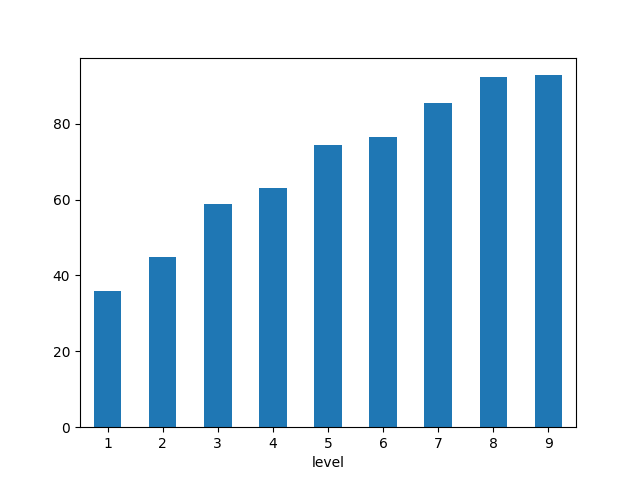
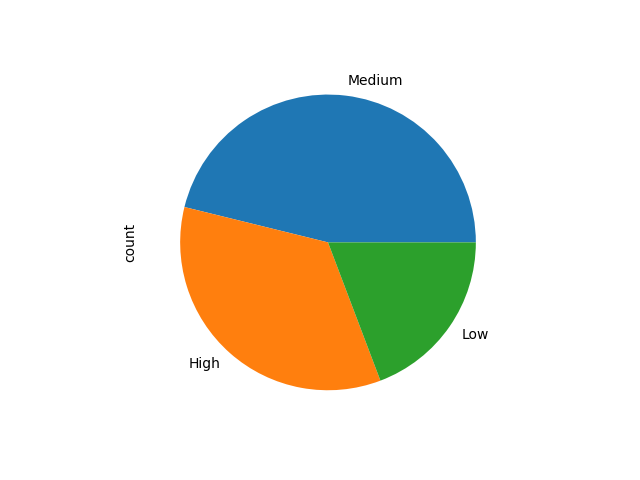

# Game Data Analytics

## Question 1 Data Manipulation 
Load CSV file
```
   game_id player_id score level            timestamp
0        1       101    85     5  2023-01-15 10:00:00
1        2       102    92     7  2023-02-20 14:30:00
2        3       103    76     4  2023-03-05 09:15:00
3        4       104    58     3  2023-04-10 11:45:00
4        5       105    99     9  2023-05-25 16:00:00
..     ...       ...   ...   ...                  ...
73      74       104    79     6  2025-04-05 11:45:00
74      75       105    47     2  2025-04-10 16:00:00
75      76       106    86     8  2025-04-15 12:30:00
76      77       107    39     1  2025-04-20 08:00:00
77      78       108    82     7  2025-04-25 15:00:00
```

The statitics of missing value
```
game_id      0
player_id    0
score        0
level        0
timestamp    0
dtype: int64
```
Updated data with the column of score_category
```
   game_id player_id score level            timestamp score_category
0        1       101    85     5  2023-01-15 10:00:00           High
1        2       102    92     7  2023-02-20 14:30:00           High
2        3       103    76     4  2023-03-05 09:15:00         Medium
3        4       104    58     3  2023-04-10 11:45:00         Medium
4        5       105    99     9  2023-05-25 16:00:00           High
..     ...       ...   ...   ...                  ...            ...
73      74       104    79     6  2025-04-05 11:45:00         Medium
74      75       105    47     2  2025-04-10 16:00:00            Low
75      76       106    86     8  2025-04-15 12:30:00           High
76      77       107    39     1  2025-04-20 08:00:00            Low
77      78       108    82     7  2025-04-25 15:00:00           High
```

Group the data by level and calculate the average score for each level

```
level
1    36.000000
2    44.875000
3    58.857143
4    63.090909
5    74.416667
6    76.500000
7    85.363636
8    92.250000
9    92.800000
Name: score, dtype: float64
```

## Question 2 Data Analysis 
What is the average score of players across all levels?
```
>>> Answer: 69.21794871794872
```

Which level has the highest average score?
```
>>> Answer: 9
```

How many players scored in the 'High' category?
```
>>> Answer: 8
```


## Question 3 Data Visualization 
Create a bar chart that shows the average score for each level



Create a pie chart that displays the distribution of score categories ('Low', 'Medium', 'High')


## Question 4 Player Id Function
Write a function that takes a player_id as input and returns the player's highest score and the level at which it was achieved

```python
def query_about_player_highest_score_and_level_achieved(player_id):
    player_records = cleaned_data[cleaned_data["player_id"] == player_id]
    highest_score = player_records["score"].max()
    level_achieved = player_records["level"].max()
    return highest_score, level_achieved
```
